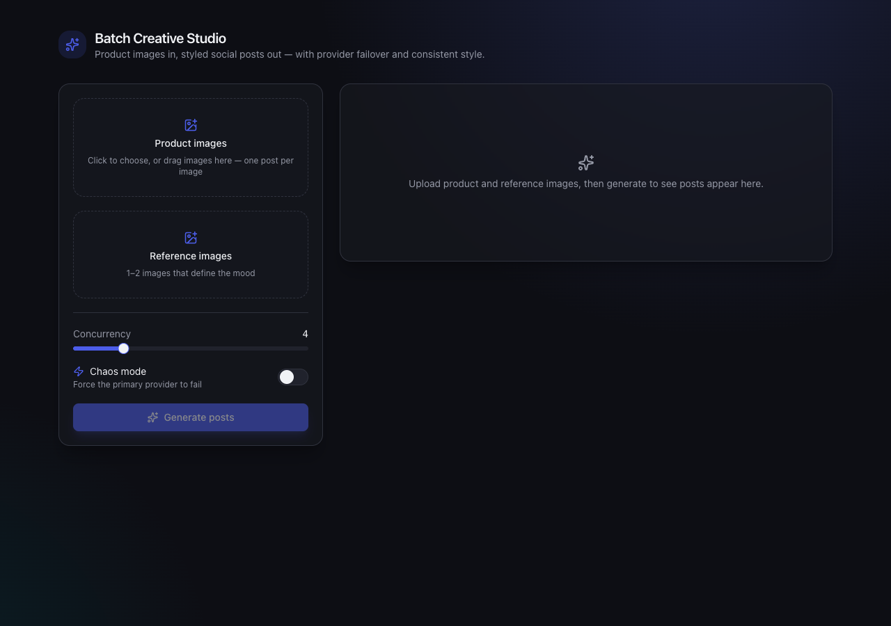
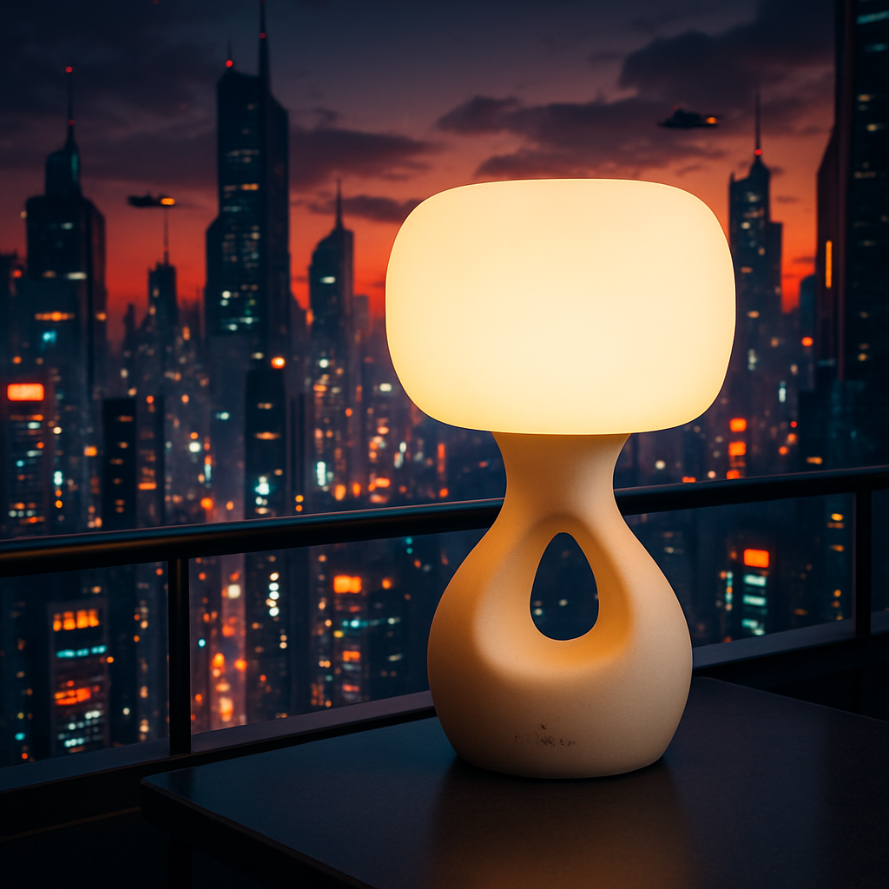

# Batch Creative Studio

Turn **N product images + 1–2 reference images** into ready-to-post social posts,
one styled, in-context product image per product paired with a generated
**title, caption, and hashtags**, plus the reliability engineering around it:
**retries**, **multi-provider failover**, and a **consistent visual style** across
the batch.

> Engineering take-home, Track 02 (Batch Creative API).



## What it does

Upload a set of product photos and a couple of reference images that set the mood.
The app reads the style from the references once, then for every product it
generates an in-context image and writes a matching social post (title, caption,
hashtags), streaming progress back to the UI, continuing past any single failure.

## What it produces

One reference sets the mood; every product is dropped into **that same world**,
with a caption in the same voice. The consistency is derived once and applied across
the whole batch, here across three unrelated products from a single reference:

**Reference** (the mood to match):


**→ three products, one coherent look** (real output, generated by this app):

|  |  |  |
| :-----------------------------------------------------------------------------------------------------: | :-------------------------------------------------------------------------------------------------------: | :------------------------------------------------------------------------------------------------------------------: |
|                                   **Illuminate Your Cyberpunk Oasis**                                   |                                            **Future Unlocked**                                            |                                               **Level Up Your Locks**                                                |
|                                  `#CyberpunkDecor` `#LumantisLighting`                                  |                                      `#CyberpunkTech` `#FuturePhone`                                      |                                          `#CyberpunkHair` `#VeloraHaircare`                                          |

Same dusk skyline, same warm-to-deep-blue palette, same ledge framing, three
different products, one batch. Every product runs through retry and image-provider
failover; flip **Chaos mode** in the app to watch the primary fail over to the
secondary, live.

## How it works

```
POST /batch  (products[], refs[])  → { jobId }                    work continues async
GET  /batch/:jobId           → { status, succeeded[], failed[] }  the UI polls until done

per batch:   style = describe(refs)              once, applied to every product
per product: image = execute([gemini, openai])   retry + failover (+ optional judge gate)
             post  = openrouter(structured)       title/caption/hashtags, Zod-validated
             store image + social post
             → partial success: one item failing never fails the batch
```

The reliability layer is a single generic **resilience executor** wrapping every
provider call: exponential backoff + jitter, per-attempt `AbortController`
timeout, failover to the next provider, and a structured `AggregateError` if all
fail. Image generation fails over across **two providers** (Gemini, then OpenAI),
each call carrying the product and the reference images; the text calls (style,
copy, judge) run through OpenRouter, which adds model-level fallback behind one
key. A **chaos toggle** forces the primary image provider to fail so failover is
observable live in the UI. Visual consistency comes from a **style spec** (a
shared descriptor and palette) read once from the references and sent with every
product, plus the reference images on each image call; a stable seed adds
reproducibility on providers that support it (Gemini).

It deploys as a static web build on **Vercel** with the API on a long-lived host
(**Railway**). The public `/batch` endpoint sits behind a basic spend guard
(per-IP and global caps), so heavy use can temporarily pause new generations.

## Quickstart (local)

Requires Node 22+ and pnpm (`corepack enable` provides it).

```bash
pnpm install
cp .env.example server/.env        # add your provider keys (see below)

pnpm --filter @app/server dev      # API on :8787
# then, in a second terminal:
pnpm --filter @app/web dev         # UI on :5173
```

Open http://localhost:5173, pick a couple of the built-in product samples and a
reference (or upload your own), then **Generate**. Flip **Chaos mode** first to
watch failover from the primary to the secondary provider.

### Environment

| Variable             | Required | Purpose                                                                                     |
| -------------------- | -------- | ------------------------------------------------------------------------------------------- |
| `OPENROUTER_API_KEY` | yes      | Post copy (title/caption/hashtags) + style read + judge ([key](https://openrouter.ai/keys)) |
| `GEMINI_API_KEY`     | one of\* | Primary image provider ([key](https://aistudio.google.com/apikey))                          |
| `OPENAI_API_KEY`     | one of\* | Failover image provider ([key](https://platform.openai.com/api-keys))                       |
| `PORT`               | no       | API port (default 8787)                                                                     |
| `PUBLIC_BASE_URL`    | no       | Base URL images are served from                                                             |
| `WEB_ORIGIN`         | no       | Allowed CORS origin (defaults to any)                                                       |
| `JUDGE_THRESHOLD`    | no       | Enable the LLM quality gate (0–1); off when unset                                           |

\* Set at least one image provider. With both, Gemini is primary and OpenAI is the failover (and Chaos mode demos failover between them).

The web app reads `VITE_API_URL` (defaults to `http://localhost:8787`).

## Tech stack

- **API:** Node + TypeScript (strict), Hono, Zod, p-limit, pino
- **Providers:** OpenRouter (post copy + style + judge), Gemini 2.5 Flash Image +
  OpenAI `gpt-image-1` (images, behind one port)
- **Web:** Vite + React + Tailwind v4 + shadcn-style Radix components, Zustand,
  TanStack Query, Framer Motion, sonner
- **Shared:** `@app/contracts`, Zod schemas used by both API and web

## Quality

- `pnpm lint && pnpm typecheck && pnpm test && pnpm build`, all green; CI runs them on every PR.
- **101 behaviour-focused tests** covering the resilience executor, batch
  orchestration, providers (via injected `fetch`), and the HTTP layer.
- Standards are **machine-enforced** (ESLint complexity caps, Husky, commitlint),
  see [`docs/governance/`](docs/governance).
- Every phase shipped as a reviewed PR; see [the architecture decisions](docs/architecture/adr).

## How this was built

The brief values _how you work with AI tools_, so this was built with **Claude Code**
as a pair engineer, on an explicit harness rather than ad-hoc prompting:

- **idea → design spec → reviewed plan → phased PRs**, each into a protected `main`.
- **a parallel review committee**, every PR is reviewed by specialised subagents
  (correctness, architecture/types, security, accessibility), synthesised, and
  addressed before merge. It caught real defects a single pass misses: a
  timeout-classification race, a job-store aliasing bug, a missing Gemini
  `responseModalities` (would have broken _every_ image call), an AA contrast failure.
- **live docs via MCP**, context7 for current provider/API shapes, playwright for
  browser QA of the end-to-end flow.

The breadth below was cheap _because_ of that harness. More in
[`docs/governance/ai-usage.md`](docs/governance/ai-usage.md).

## Scoping & judgment

The brief asks for a focused half-day and grades judgment over polish, so effort went
where the track grades (**good output, visible reliability, AI fluency**) and stayed
deliberately thin everywhere else.

**The core, kept small:** one generic resilience executor (retry + failover) wrapping
every provider; one style spec applied across the whole batch for consistency; one
social post per product. That's the graded surface, everything else serves it.

**Deliberately cut** (named, not hidden):

- **No queue/workers/DB/auth**, in-memory job store + polling is enough at this scale;
  a real queue is the first production add.
- **Basic spend guard, not full rate-limit infra**: the public deploy gets an
  in-memory per-IP and global cap on the paid endpoint plus a per-request product
  limit; no Redis-backed limiter or auth (it's public for assessors). The
  provider-side spend caps are the hard backstop. See
  [`docs/governance/security.md`](docs/governance/security.md).
- The **judge gate** is wired but off by default (cost); enable via `JUDGE_THRESHOLD`.

The governance docs, ADRs, and tests are intentionally light scaffolding, cheap to
maintain with the AI harness above, there to keep the small core honest, not to polish
infra the brief deprioritises.

## Deploying

See [`docs/deploy.md`](docs/deploy.md), API on Railway/Render (long-lived, for the
async batch), web on Vercel (static), with the env wiring for both.

## Repository layout

```
server/              Hono API (the deliverable)
web/                 Vite + React demo
packages/contracts/  Zod schemas shared by server + web
docs/                governance, architecture (ADRs), deploy guide
```
